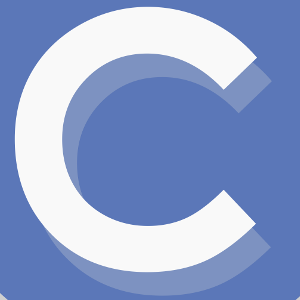

# Curso_C 

```shell
December 2019
email: rhodfra@gmail.com
Lenguaje C
```
<p align="center">
    
</p>

El repositorio es una guía para aprender o impartir un buen curso de C. En este repositorio se pretende incluir los temas, ejemplos, ejercicios y prácticas que ayuden a fortalecer el aprendizaje de dicho lenguaje de programación.

El lenguaje C fue desarrollado pro *Denis Ritchie* en los laboratorios Bell entre 1972 y 1973. Pese a ser un lenguaje viejo, se sigue usando por su **rapidez y estabilidad**. Su uso se da principalmente en sistemas operativos como el caso de los *nix, sistemas embebidos, etc.

Los temas a tratar en este repositorio se encuentran [TEMARIO](TEMARIO.md)


## Project Structure

```markdown
./curso_c
├── CHANGELOG.md
├── CONTRIBUTING.md
├── ejercicios/
├── img
│   └── cover.png
├── INSTALL.md
├── LICENCE.md
├── practicas/
├── proyectos/
├── README.md
├── TEMARIO.md
└── temas/
    ├── tema-00.md
    └── tema-01.md
```

## Contributing 

La forma de contribuir y el código de conducta se explican en [CONTRIBUTING](CONTRIBUTING).
