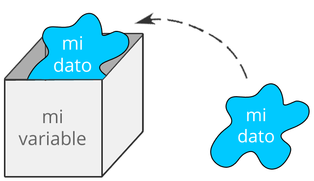
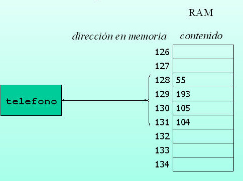

# Curso C

[TOC]

## Elementos de un programa en C

En el lenguaje C existen **palabras reservadas** que no las podemos utilizar como identificadores de variables o funciones. Así mismo, existen **simbolos** que el lenguaje tiene reservados para ciertas tareas, a continuación se listan algunas palabras o simbolos reservados, los cuales se irán ocupando a lo largo del curso.

<!-- Agregar tabla de simbolos y palabras reservadas -->

Los **comentarios** se identifican por estar encerradas por `/* */` por porque la línea inicia con `//` y estos no son tomados en cuenta a la hora de la compilación por lo cual se suelen utilizar para

* Explicar la lógica que se siguió en un programa difícil de comprender.
* Anotaciones
* Comentar código que no funciona.

Para analizar los elementos de un programa en C hagamos el famoso "Hola Mundo".

```c
#include<stdio.h> 
int main(){
    printf("Hola mundo");
    // Esto es un comentario de línea
    /*
    	Esto es un comentario de varias
    	líneas
    */
    int edad = 5;
    if(edad > 5){
        printf("Tienes más de 5 años")
    }
}
```

* El programa inicia  un encabezado o *cabecera* como usualmente se le conoce.
* Todas las instrucciones se encuentran dentro del bloque `int main(){`
* La palabrar reservada `printf()` es una función que nos ayuda a imprimir texto en la consola.

### Consideraciones

* Todas las sentencias terminan con `;`
* Las instrucciones se suelen agrupar en bloques, dichos bloques son representados por `{ }`, en las siguientes secciones se indica cuando usar llaves y cuándo no, de momento
  * Después de la palabra reservada `main()` se pone llave que abre `{`  y al terminar nuestro programa se pone llave que cierra `{`
* Distingue entre mayúsculas y minúsculas.

Como se puede observar en el ejemplo anterior, tenemos una estructura básica para que el compilador pueda compilar nuestro programa. Para un programa se puede ejecutar siempre se debe contar con una *función `main()`*, que se le conoce como *punto de entrada*, sin ella el sistema operativo no sabrá donde empezar a ejecutar las instrucciones.

```c
#include<stdio.h>
int saludar(){
    printf("Hola mundo");
}
// El compilador marcará error.
```

En C el punto de entrada o *entry point* se puede declarar de las siguientes maneras

```c
int main(void);
int main();

// Estas opciones se revisarán posteriormente
int main(int argc, char **argv);
int main(int argc, char *argv[]);
int main(int argc, char **argv, char **env);

// more specifically in C
// NOT according to the ISO C standard 5.1.2.2.1
// BUT in embedded programming depending on the µC, this form is also used
void main (void);
```

<!-- Falta hablar de las cabeceras y bibliotecas -->

## Variables, constantes y tipos de datos

Una **variable** se puede definir de varias maneras

* > Una variable es un objeto que puede cambiar su valor durante el desarrollo de un programa o algoritmo. [Joyanes,1996]

* > Una variable es una ubicación de almacenamiento emparejada con un nombre simbólico asociado, que contiene alguna cantidad conocida o desconocida de información denominada valor.  [Wikipedia]

* Una variable es donde se guarda (y se recupera) datos que se utilizan en un programa.

Finalmente se suele hacer la siguiente analogía para comprender el significado y uso de las variables en la programación.

> Una variable es como una caja etiquetada en la cual guardas cosas.



Una variable en realidad es un espacio de memoria reservado en la RAM (como se observa en la siguiente imagen, pero para fines prácticamos podemos (y por ahora) podemos pasar desapercibido esto.



**Los tipos de datos** describen lo que se pueden guardar en una variable. Cada lenguaje de programación define sus tipos de datos como mejor le parezca.

Por otra parte, tenemos **constantes** que son *similares* a las variables, excepto porque su valor no puede ser alterado a lo largo de la ejecución del programa.

### Declaración y asignación de variables en C

Antes de definir qué es la declaración y asignación de variables, la siguiente definición es vital

Una **expresión** es una combinación de valores y operaciones que, al ser evaluados, entregan un valor.

> Una **expresión** es una combinación de constantes, variables o funciones, que es interpretada de
> acuerdo a las normas particulares de precedencia y asociación para un lenguaje de **programación** en particular.

* Se puede hacer la analogía a las expresiones matemáticas.
* Las expresiones se suelen utilizar *asignandolas* a una variable.

Algunos ejemplos de expresiones serían

```c
3+4; // resultado 7
4*3-2; // resultado 10
x/2 + 3; //resultado depende del valor x pero, regresará un número
a + b != c // Depende de los valores a,b y c pero,regresará "falso" o "verdaddero"
```

Para **declarar** una variable en lenguaje C se deben escribir dos cosas: el tipo de variable y un identificador (nombre de la variable).

La **asignación** de un valor inicial a una variable se le conoce como **inicialización**.

```c
//tipo identificador;
int calificacion; // Acepta números enteros positivos o negativos
unsigned int edad; // Acepta números enteros positivos
float dinero; // Acepta decimales
double saldo; // Acepta decimales muy grandes
long double herencia; // Acepta decimales más grandes

int temperatura; // Se declara la variable.
temperatura = 20; // La variable se inicializa con un valor de 20.
/* Suponer que la temperatura aumento, 
entonces se desea actualizar la variable a 22*/
temperatura = 22;
temperatura = 22.3; // Fallará porque la variable fue declarada como entero.

int telefono = 5571242783; // Variable declarada e inicializada con el valor 5571242783
int paquete_id = 34.6; // Fallará porque el tipo de dato no coincide con el valor asignado
```

Las variables deben ser declaradas antes de ser usadas, el siguiente ejemplo no se ejecutará porque presenta un error, ¿Cuál es?

```c
#include<stdio.h>
int main(){
    //int temperatura;
    //int temperatura = 30;
    printf("La temperatura de hoy es",temperatura); // Error;
    
    return 0;
}
```

## Tipos de datos

<!-- Tipado estático y dinámico y fuertemente tipado contra débilmente tipado -->

Los tipos de datos (como ya dijimos anteriomente) describen lo que se puede guardar en una variable, en otras palabras, cada variable tiene un tipo de datos asociado (siempre).

* Cada tipo de datos requiere diferentes cantidades de memoria y tiene algunas operaciones específicas que se pueden realizar sobre él.

* Cada lenguaje define sus tipos de datos

* En C los tipos de datos son usados para:

  * Identificar el tipo de una variable cuando se declara.

  * *Identificar el tipo del valor de retorno de una función.*
  * *Identifique el tipo de un parámetro esperado por una función.*

Los dos últimos puntos se verán en el **tema de funciones**.

Para el caso del lenguaje C, sus tipos de datos se pueden agrupar en las siguientes categorias

**NOTA** : Concentraremos nuestros esfuerzos en comprender enteramente los tipos de datos primarios ya que serán nuestra heramienta de trabajo más común.

* **Tipos de datos primarios o primitivos (o incorporados; Buit-in)**: Esta categoria de tipos de datos esta presente en cualquier estándar de C, son universales.
  * *Números enteros*: Números positivos y negativos sin decimal.
    * Los numeros enteros se denotan con la palabra reservada `int`.
  * *Números reales o de punto flotante*: Números positivos y negativos con decimal
    * Hay dos tipos de datos para representar números reales: `float` y `double`.
    * La *precisión* del número depende del tipo de dato y el *modificador* seleccionado.
    * La representación de estos números no es trivial para la computadora.
  * *Caracteres*: 
    * Para denotar que una variable puede almacenar *UN* caracter utilizaremos la palabra reservada `char`
* **Tipos de datos agregados al C99**
  * *_Bool*: Una variable boolena puede tener solo algunos de dos estados: falso o verdadero
  * *_Complex*: Sirve para representar números complejos
  * *_Imaginary*: Sirve para representar números imaginarios
* **Tipos de datos derivados o compuestos**: Se consideran tipos de datos
  * *Arreglos*: Los arreglos son conjuntos de espacios de memoria contiguos que comparten un mismo tipo. Existe una sección dedicada a este tema.
  * *Cadenas*: El lenguaje C representa *cadenas de texto* mediante arreglos con ciertas restricciones.
  * *Punteros*: Más adelante se dedica toda una sección a los apuntadores los cuales son elementos muy poderosos del lenguaje.
* **Tipos definidos por el usuario**: El usuario puede definir nuevos "tipos de datos" a través de los siguiente elementos.
  * *Estructura*: Es un paquete de variables de diferentes tipos bajo un solo nombre. 
    * Esto se hace para manejar los datos de manera eficiente. 
    * La palabra clave `struct` se utiliza para definir una estructura.
  * *Union*: 
  * *Enumeracion*: La enumeración es un tipo de datos especial que tiene constantes enteras, y a cada una de ellas se le asigna un nombre específico. 
    * La palabra clave `enum` se utiliza para definir el tipo de datos enumerados.
* **Tipos de datos incompletos**
  * **void**: El tipo de vacío especifica que no hay ningún valor disponible. Se utiliza en tres tipos de situaciones.
    * *La función no regresa algún valor*: Hay varias funciones en C que no devuelven ningún valor o puede decir que devuelven nulo. Una función sin valor de retorno tiene el tipo de retorno como nulo. Por ejemplo, `void exit (int status);`
    * *La función no recibe ningún parámetro (o argumento)*: Hay varias funciones en C que no aceptan ningún parámetro. Una función sin parámetro puede aceptar un vacío. Por ejemplo, `int rand (void);`
    * *Un punto a vacío*: Un puntero de tipo `void *` representa la dirección de un objeto, pero no su tipo. Por ejemplo, una función de asignación de memoria `void * malloc (size_t size);` devuelve un puntero a void que se puede convertir a cualquier tipo de datos.

### Tipos de datos primitivos

En resumen vamos a identificar cuando usar `int`, `float`, `double` y `char` así como las operaciones que podemos aplicarle a cada uno.

Para los enteros se pueden aplicar todos los operadores del lenguaje C.

Para los flotantes y dobles se pueden emplear casi todos los operadores del lenguaje C con las siguientes excepciones

* Modulo
* Operadores bit a bit

Cada tipo de dato ocupa cierto *espacio en memoria*, en otros lenguajes el tamaño que ocupen no es tan importante como en C. La razón es que C se ejecuta en sistemas operativos y sistemas embebidos.

Por otra parte, cada tipo de datos tiene un rango de valores que pueden almacenar.

| Tipo de dato | Tamaño de almacenamiento en memoria | Rango                           | Precision               | Especificador de formato |
| ------------ | ----------------------------------- | ------------------------------- | ----------------------- | ------------------------ |
| int          | 4 Bytes                             | -2,147,483,648 to 2,147,483,647 | NA                      | %d                       |
| float        | 4 Bytes                             | 1.2E-38 to 3.4E+38              | 6 lugares decimales     | %f                       |
| double       | 8  Bytes                            | 2.3E-308 to 1.7E+308            | 15 posiciones decimales | %lf                      |
| char         | 1 Byte                              | -128 to 127                     | NA                      | %c                       |

#### Modificadores 

Existen ciertas palabras reservadas del lenguaje C llamadas modificadores de tipo que pueden acompañar a los tipos básicos de datos los cuales son

* Modificadores de signo 
  * signed (Signado): Se toman en cuenta números positivos y negativos
  * unsigned (No signado): Se toman en cuenta solo números positivos
* Modificadores de tamaño
  * short (Corto)
  * long (largo)

Los modificadores de signo y de tamaño no son mutuamente excluyentes por lo que se podrían llegar a encontrar conmbinados

| Modificador    | Tipo de dato | Tamaño de almacenamiento en memoria | Rango de valores                           | Especificador de formato |
| -------------- | ------------ | ----------------------------------- | ------------------------------------------ | ------------------------ |
| signed char    | char         | 1 byte                              | -128 a 127                                 | %c                       |
| unsigned       | char         | 1 byte                              | 0 a 255                                    | %c                       |
| unsigned       | int          | 2 o 4 bytes                         | 0 to 65,535 o 0 a 4,294,967,295            | %u                       |
| short          | int          | 2 bytes                             | -32,768 to 32,767                          | %hd                      |
| unsigned short | int          | 2 bytes                             | 0 a 65,535                                 | %hu                      |
| long           | int          | 8 bytes                             | -9223372036854775808 a 9223372036854775807 | %ld                      |
| unsigned long  | int          | 8 bytes                             | 0 a 18446744073709551615                   | %lu                      |
| long           | double       | 10 o 12 bytes                       | 3.4E-4932 to 1.1E+4932                     | %Lf                      |

**Consideraciones**

* NO existen los siguientes tipos: `short float`, `long float`, `short double`.
* La precisión de `long double` es de 19 posiciones decimales.

* Los modificadores sin tipo serán considerados de tipo int, esto es:
  * `short x` Es equivalente a decir `short int x;`

La progresiva utilización de procesadores de 64 bits (en la actualidad, ¿Quién no cuenta con uno de ellos?)  junto con el crecimiento espectacular de la memoria disponible, tanto en RAM como en disco, hace que sea razonable esperar versiones de C que permitan utilizar enteros con más de 32 bits.  Por lo cual desde hace 20 años se empezaron a incluir tipos de datos que aprovecharán todo poder del CPU y la RAM combinados:

| Modificador        | tipo de dato | Alamacenamiento en memoria | Rango                          | Especificadores de formato |
| ------------------ | ------------ | -------------------------- | ------------------------------ | -------------------------- |
| long long          | int          | 8 bytes                    | -(2^63) a (2^63)-1             | %lld                       |
| signed long long   | int          | 8 bytes                    | -(2^63) a (2^63)-1             | %lld                       |
| unsigned long long | int          | 8 bytes                    | 0 a 18,446,744,073,709,551,615 | %llu                       |

https://www.w3schools.in/c-tutorial/data-types/

### Otros tipos de datos importantes

#### Números complejos

Para trabajar con números complejos existen la biblioteca `complex.h`

https://en.cppreference.com/w/c/numeric/complex

```c
#include <stdio.h>
#include <complex.h>
#include <tgmath.h>
 
int main(void)
{
    double complex z1 = I * I;     // imaginary unit squared
    printf("I * I = %.1f%+.1fi\n", creal(z1), cimag(z1));
 
    double complex z2 = pow(I, 2); // imaginary unit squared
    printf("pow(I, 2) = %.1f%+.1fi\n", creal(z2), cimag(z2));
 
    double PI = acos(-1);
    double complex z3 = exp(I * PI); // Euler's formula
    printf("exp(I*PI) = %.1f%+.1fi\n", creal(z3), cimag(z3));
 
    double complex z4 = 1+2*I, z5 = 1-2*I; // conjugates
    printf("(1+2i)*(1-2i) = %.1f%+.1fi\n", creal(z4*z5), cimag(z4*z5));
    
    return 0;
}
```

#### _Bool

Para manejar tipo de datos booleanos (cero o uno) existen varias técnicas y librerias que podemos utilizar.

Lo más importante que debemos saber es que el lenguaje C considera lo siguiente

* Falso : Tiene el valor de cero (`0`)
* Verdadero : Todo número distinto de cero

Para utilizar booleanos debemos incluir la libreria `stdbool.h`

**PERO** Si se utiliza la libreria `stdbool.h` debemos tener cuidado ya que

* Falso = 0 
* Verdadero = 1

_bool es una palabra reservado en lenguaje de programación C que representa el tipo de datos booleanos.

- Es una alternativa a bool en C. 
- De hecho, bool es un alias de _bool. 
- Esto se hizo considerando el uso histórico de C como un intento de mantener la compatibilidad.

```c
#include <stdio.h>
#include <stdbool.h>

int main() {
  bool x = false;
  if(x == true){
    printf("x is true.");
  }
  else{
    printf("x is false.");
  }
  
  return 0;
}
```

#### Enum

**Otra opción para trabajar con booleanos**

Se puede utilizar `enum`

```c
#include <stdio.h>

//typedef enum {false, true} bool;
typedef enum {false=0, true=1} bool;
//enum bool{false,true};
int main() {
  bool x = false;
  if(x == true){
    printf("x is true.");
  }
  else{
    printf("x is false.");
  }
  
  return 0;
}
```

Otros ejemplos comunes del uso de `enum` son para: dias de la semana, meses del año, estados de una máquina

#### Cadenas

Esta sección es una introducción del manejo de cadenas ya que se verá posteriormente el manejo de cadenas con ayuda de la biblioteca `string.h`.

***Una cadena es un conjunto de caracteres con la particularidad que tienen una marca en el fin del mismo (el caracter '\0')***

* Las cadenas se escriben entre comillas dobles.
* Un SOLO caracter se escribe en comillas simples.

```c
char cadena_hola[]="Hola";
char otro_hola[]={'H','o','l','a','\0'}; // Igual al anterior

char vector[]={'H','o','l','a'}; /* Un vector de 4 elementos,con los elementos 'H','o','l' y 'a' */

char espacio_cadena[1024]="Una cadena en C";
char cadena_vacia[]="";
```

## Entrada por teclado

* scanf() y su sintaxis
* lectura de cadenas mediante fgets()

Para leer datos de la entrada estándar (el teclado) utilizaremos la función `scanf()`

```c
#include <stdio.h>

int main () {
    
   // Este ejemplo guarda un número en n.
    int n;
    printf("Introduce un numero: ");
    scanf("%d",&n);

    // Este ejemplo guarda un caracter en m.

    char m;
    printf("Introduce un caracter: ");
    scanf("%c",&m);

    // Este ejemplo guarda una cadena de caracteres 
    //(solamente una palabra) en cad. 
    // Notese la ausencia de &
    
    printf("Introduce dos enteros separados por un espacio: \n");
  	scanf("%d %d", &entero1, &entero2);

    char cad[20];
    printf("Introduce una palabra: ");
    scanf("%s",cad);

    printf("Introduce una palabra: ");
    scanf("%10s",cad);  // lee máximo 10 caracteres y 
    //le concatena el caracter cero. 
    
    char str[100];
   	printf("Enter a string in lower case: ");
   	scanf("%[a-z]",str);
   	printf("String = %s\n",str);
    
    int a; 
    scanf("This is the value %d", &a); 
    printf("Input value read : a = %d", a); 
    
   char str1[20], str2[30];

   printf("Enter name: ");
   scanf("%s", str1);

   printf("Enter your website name: ");
   scanf("%s", str2);

   printf("Entered Name: %s\n", str1);
   printf("Entered Website:%s", str2);
    
   int a; 
   scanf("%*s %d", &a); 
   printf("Input value read : a=%d",a); 
    
   return(0);
}
```

* https://www.programiz.com/c-programming/c-strings
* https://stackoverflow.com/questions/7709452/how-to-read-string-from-keyboard-using-c/24177745
* https://www.knowprogram.com/c-programming/read-and-display-the-string-in-c-programming/
* 

## Conversión de tipo de datos

<!--sizeof() -->

## Operadores

Los **operadores** son símbolos que indican cómo se deben manipular los operandos.  La función de cada **operador** depende del tipo que se esté utilizando, a continuación se analizan los tipos de operadores que existen.

### Operadores aritméticos

Los operadores aritméticos son los operadores que nos permiten realizar operaciones matemáticas: **suma, resta, multiplicación, división y resto**.

| Operador | Significado                                       |
| -------- | ------------------------------------------------- |
| +        | Suma dos números o variables del mismo tipo       |
| -        | Resta dos números o variables del mismo tipo      |
| *        | Multiplica dos números o variables del mismo tipo |
| /        | Divide dos números o variables del mismo tipo     |
| %        | Operador resto o *módulo*                         |

### Operadores relacionales o de comparación

| Operador | Significado                 |
| -------- | --------------------------- |
| ==       | Igual que (Identidad)       |
| !=       | Diferente que (Desigualdad) |
| <        | Menor que                   |
| <=       | Menor o igual que           |
| >        | Mayor que                   |
| >=       | Mayor o igual que           |

### Operadores lógicos

Se tienen 3 operadores lógicos

| Operador | Significado       |
| -------- | ----------------- |
| &&       | Operador and      |
| \|\|     | Operador or       |
| !        | Operador negación |

### Operadors bit a bit

### Operador ternario

### Operadores especiales

* Post incremento
* Pre incremento

## Estructuras de control

### Estructuras condicionales

#### Sentencia If

#### Sentencia switch

### Estructuras iterativas

#### Setencia For

https://beginnersbook.com/2014/01/c-for-loop/

#### Setencia While

#### Sentencia do while

## Arreglos

### Formas de declarar un arreglo

