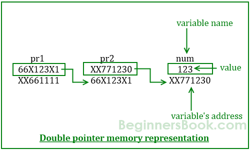
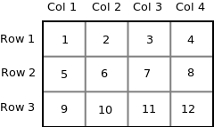
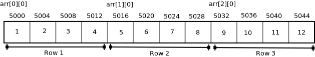
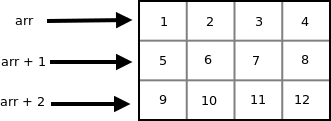
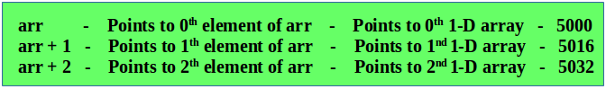
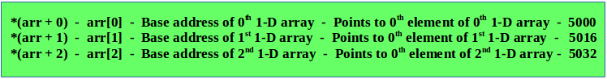
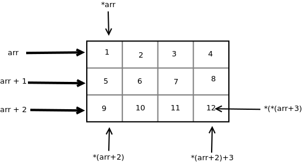
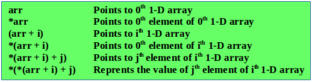
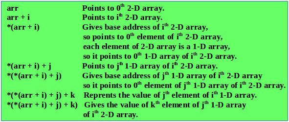

# Curso C

[TOC]

## Manejo de memoria dinámica

### Tipos de memoria

Existen dos maneras para que nuestros programas reserven memoria. 

Cada que creamos variables, por ejemplo `int var = 10` en la memoria RAM se reserva memoria, en este caso se reservan 4 bytes, dado que el tipo de dato `int` ocupa 4 bytes. 

#### Memoria estática

Analicemos el siguiente escenario: 

```c
#include<stdio.h>

int main(){
    int arreglo[20];
    return 0;
}
```

Tenemos un arreglo cuya longitud es 20, ¿Qué pasa si de esos 20 lugares solo utilizamos 10?

Las otras 10 posiciones se estarían desperdiciando y no hay nada que podamos hacer si estamos regidos bajo el **estándar c89**. Bajo el **estándar c99** (depende de la implementación del compilador) se puede hacer algo.

```c
#include<stdio.h>

int main(){
    int tama;
    printf("Tama arreglo: ");
    scanf("%d",&tama);
    int arreglo[tama];
    printf("Ingrese %d al azar\n", tama);
    for (int i = 0; i < tama; ++i)
    {
    	printf("arreglo[%d]: ", i);
    	scanf("%d",&arreglo[i]);
    }

    printf("Los valores ingresados son: \n");
    for (int i = 0; i < tama; ++i)
    {
    	printf("arreglo[%d] = %d\n",i,arreglo[i] );
    }
    return 0;
}
```

Se pide el tamaño al usuario, sin embargo no es lo más adecuado y que puede darse el caso en que el usuario no conozca el tamaño, ¿Cómo solucionarlo?

#### Memoria dinámica 

La memoria dinámica es aquella que se asigna en tiempo de ejecución. Para poder uso de la memoria dinámica utilizaremos el procedimiento llamado **asignación de memoria dinámica**.

### Asignación de memoria dinámica

C proporciona algunas funciones para utilizar memoria dinámica. Hay 4 funciones de biblioteca proporcionadas por C definidas en el archivo de encabezado `<stdlib.h>` para facilitar la asignación de memoria dinámica en la programación en C. Son:

1. malloc ()
2. calloc ()
3. free()
4. realloc ()

#### Uso de malloc()

```c
#include <stdio.h> 
#include <stdlib.h> 

int main() 
{ 
    int* ptr; 
    int n, i; 

    n = 5; // Es la longitud (variable) del arreglo
    printf("La longitud del arreglo será: %d\n", n); 

    // asignacion por memoria dinamica
    ptr = (int*)malloc(n * sizeof(int)); 

    // Verifica si fue posible asignar la memoria
    if (ptr == NULL) { 
        printf("Memory not allocated.\n"); 
        exit(0); 
    } 
    else { 

        printf("Memory successfully allocated using malloc.\n"); 

        // Llenando el arreglo de manera dinamica.
        for (i = 0; i < n; ++i) { 
            ptr[i] = i + 1; 
        } 

        printf("The elements of the array are: "); 
        for (i = 0; i < n; ++i) { 
            printf("%d, ", ptr[i]); 
        } 
        printf("\n");

        printf("Rellenando el arreglo con notacion de apuntadores: \n");
        for (int i = 0; i < n; ++i)
        {
            *(ptr+i) = i + 5;

        }
        printf("Imprimiendo el arreglo con notacion de apuntadores:\n");
        for (int i = 0; i < n; ++i)
        {
            printf("%d, ", *(ptr+i));
        }
        printf("\nLiberarmos memoria al terminar de usarla.");
        free(ptr);
    } 

    return 0; 
}
```
#### Acerca de free()

Es una muy mala práctica no liberar la memoria. Liberar memoria se refiere a decirle a sistema operativo que hemos dejado de ocupar la memoria que nos asigno. Es importante indicarle lo anterior de lo contrario el sistema operativo no podrá disponer de dicha memoria y si no contamos con mucha memoria RAM entonces la computadora ya no podrá abrir muchos programas.

Para liberar la memoria usamos la instrucción `free(pointer)` y como parámetro le tenemos que pasar un apuntador.

#### Uso de realloc()

```c
#include <stdio.h> 
#include <stdlib.h> 

int main() 
{  
	int* ptr; 
	int n, i; 

	n = 5; 
	printf("Enter number of elements: %d\n", n); 

	// Reservamos la memoria 
	ptr = (int*)calloc(n, sizeof(int)); 

	if (ptr == NULL) { 
		printf("Memory not allocated.\n"); 
		exit(0); 
	} 
	else { 

		printf("Memory successfully allocated using calloc.\n"); 

		for (i = 0; i < n; ++i) { 
			ptr[i] = i + 1; 
		} 

		printf("The elements of the array are: "); 
		for (i = 0; i < n; ++i) { 
			printf("%d, ", ptr[i]); 
		} 

		// Reasignemos el tamaño del arreglo
		n = 10; 
		printf("\n\nEnter the new size of the array: %d\n", n); 

		// Dynamically re-allocate memory using realloc() 
		ptr = realloc(ptr, n * sizeof(int)); 

		// Memory has been successfully allocated 
		printf("Memory successfully re-allocated using realloc.\n"); 

		// Get the new elements of the array 
		for (i = 5; i < n; ++i) { 
			ptr[i] = i + 1; 
		} 

		// Print the elements of the array 
		printf("The elements of the array are: "); 
		for (i = 0; i < n; ++i) { 
			printf("%d, ", ptr[i]); 
		} 

		free(ptr); 
	} 

	return 0; 
} 
```

### Memoria dinámica, doble apuntador y arreglo bidimensional (matriz)

#### Apuntador doble (apuntador a apuntador)



```c
num == *pr2 == **pr1
&num == pr2 == *pr1
&pr2 == pr1
```

```c
#include <stdio.h>
int main()
{
     int num=123;

     //A normal pointer pr2
     int *pr2;

     //This pointer pr2 is a double pointer
     int **pr1;

     /* Assigning the address of variable num to the
      * pointer pr2
      */
     pr2 = #

     /* Assigning the address of pointer pr2 to the
      * pointer-to-pointer pr1
      */
     pr1 = &pr2;

     /* Possible ways to find value of variable num*/
     printf("\n Value of num is: %d", num); // salida = 123
     printf("\n Value of num using pr2 is: %d", *pr2); // salida = 123
     printf("\n Value of num using pr1 is: %d", **pr1); // salida = 123

     /*Possible ways to find address of num*/
     printf("\n Address of num is: %p", &num); // salida: dir de num XX771230
     printf("\n Address of num using pr2 is: %p", pr2); // salida: dir de num XX771230
     printf("\n Address of num using pr1 is: %p", *pr1); // salida: dir de num XX771230

     /*Find value of pointer*/
    //salida: valor de apuntador, el valor que almacena es una DIRECCION
     printf("\n Value of Pointer pr2 is: %p", pr2); 
     printf("\n Value of Pointer pr2 using pr1 is: %p", *pr1);

     /*Ways to find address of pointer*/
     printf("\n Address of Pointer pr2 is:%p",&pr2);
     printf("\n Address of Pointer pr2 using pr1 is:%p",pr1);

     /*Double pointer value and address*/
     printf("\n Value of Pointer pr1 is:%p",pr1);
     printf("\n Address of Pointer pr1 is:%p",&pr1);

     return 0;
}
```

#### Doble apuntador + malloc()

```c
#include <stdlib.h>
main(){
	int **mat;			// integer double pointer
	int row=5,col=5;		// row = no of rows, col= no of columns
	
	int i;
	mat = (int**)malloc(row*sizeof(int*));
	for (i=0;i<row;i++)
		mat[i]= (int*)malloc(col*sizeof(int));
	
}
```

### Memoria dinámica, funciones y matriz inicializada

Este código también usa dobles apuntadores

```c
#include <stdio.h>
#include <stdlib.h>

void initMatrix(int**);
int **allocateMatrix(int,int);

int main(int argc, char const *argv[])
{

	int **mat = allocateMatrix(5,5);

	initMatrix(mat);

	printf("Los valores de la matriz son: \n");
	for (size_t i = 0; i < 5; ++i) // size_t = Entero no signado
	{
		for (size_t j = 0; j < 5; ++j)
		{
			printf("mat[%d][%d] = %d\n", i,j,mat[i][j]);
            //Poner despues de explicar notacion para ingresar a los apuntadores
            //printf("mat[%d][%d] = %d\n", i,j,*(*(mat+i)+j); 
		}
	}
	free(mat);

	return 0;
}

int ** allocateMatrix(int row, int col){
	int **mat;			// integer double pointer
	
	mat = (int**)malloc(row*sizeof(int*)); // Si no lo casteo ESTA BIEN, pero MALA práctic
	for (int i=0;i<row;i++)
		mat[i]= (int*)malloc(col*sizeof(int));
	
	return mat;
}

void initMatrix(int ** mat){

	for (int i = 0; i < 5; ++i)
	{
		for (int j = 0; j < 5; ++j)
		{
			mat[i][j] = j;
		}
	}
}
```

Analicemos con más calma que estamos haciendo al momento de usar doble apuntador.

Gráficamente (o visualmente) identificamos a las matrices o arreglos bidimensionales de la siguiente forma.



En realidad, en la memoria se verían algo así 



Al usar el primer apuntador pasa lo siguiente





En simples palabras podemos decir que accedemos a las direcciones de cada fila. 

Lo anterior se debe a que el primer apuntador apunta a un arreglo de 4 elementos (para el ejmplo de arriba), por lo tanto el apuntador va saltando de 16 en 16 bytes (ya que cada int ocupa 4 bytes y tenemos filas de 4 elementos).

Al hacer uso del segundo apuntador estamos ingresando a la *n* dirección de columna.



Lo anterior se puede resumir en la siguiente imagen.





El alcance del curso no cubre arreglos de 3 dimensiones, pero la idea de los de segunda dimensión simplemente se extrapola.



### Apuntadores  == arreglos

¿Qué pasa si conocemos el número de columnas de nuestro arreglo?

 ```c
// C program to print elements of a 2-D array  
// by scripting a pointer to an array  
#include<stdio.h> 
  
int main() 
{ 
  int arr[3][4] = {  
                    {10, 11, 12, 13},  
                    {20, 21, 22, 23},  
                    {30, 31, 32, 33}  
                  }; 
  int (*ptr)[4]; 
  ptr = arr; 
  printf("%p %p %p\n", ptr, ptr + 1, ptr + 2); 
  printf("%p %p %p\n", *ptr, *(ptr + 1), *(ptr + 2)); 
  printf("%d %d %d\n", **ptr, *(*(ptr + 1) + 2), *(*(ptr + 2) + 3)); 
  printf("%d %d %d\n", ptr[0][0], ptr[1][2], ptr[2][3]); 
  return 0; 
}
 ```

## Tema extra

### Comparando apuntadores

```c
#include <stdio.h>

const int MAX = 3;

int main () {

   int  var[] = {10, 100, 200};
   int  i, *ptr;

   /* let us have address of the first element in pointer */
   ptr = var;
   i = 0;
	
   while ( ptr <= &var[MAX - 1] ) {

      printf("Address of var[%d] = %x\n", i, ptr );
      printf("Value of var[%d] = %d\n", i, *ptr );

      /* point to the next location */
      ptr++;
      i++;
   }
	
   return 0;
}
```

### Apuntador a funciones

https://www.geeksforgeeks.org/function-pointer-in-c/amp/

### Triple apuntador

[https://www.quora.com/What-is-the-difference-between-\*p-\*\*p-\*\*\*p-in-pointers](https://www.quora.com/What-is-the-difference-between-*p-**p-***p-in-pointers)

