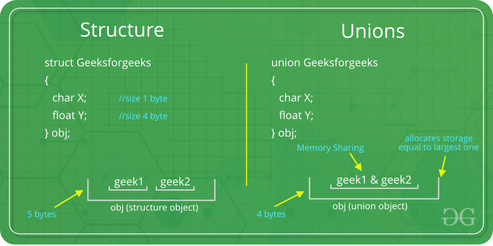

# Curso C

[TOC]

## Uniones

las uniones como las *estructuras* son tipos de datos definidos por el usuario.

En las uniones todos los miembros que pertenecen a ellatiene la misma memoria asignada.

* El operador punto nos va permitir acceder a cada miembro de la unión.
* La unión tiene como tamaño el tipo de dato más grande perteneciente a la unión.

```c
#include <stdio.h> 

// Declaration of union is same as structures 
union test { 
	int x, y; 
}; 

int main() 
{ 
	// A union variable t 
	union test t; 

	t.x = 2; // t.y also gets value 2 
	printf("After making x = 2:\n x = %d, y = %d\n\n", 
		t.x, t.y); 

	t.y = 10; // t.x is also updated to 10 
	printf("After making y = 10:\n x = %d, y = %d\n\n", 
		t.x, t.y); 
	return 0; 
} 
```

Veamos un segundo ejemplo con tipos de datos distinto.

```c
Live Demo
#include <stdio.h>
#include <string.h>
 
union Data {
   int i;
   float f;
   char str[20];
};
 
int main( ) {

   union Data data;        

   data.i = 10;
   data.f = 220.5;
   strcpy( data.str, "C Programming");
	// Que imprimiria en cada caso?
   printf( "data.i : %d\n", data.i);
   printf( "data.f : %f\n", data.f);
   printf( "data.str : %s\n", data.str);

   return 0;
}
```

**¿Qué pasa si ahora queremos hacer uso de apuntadores?**

```c
#include <stdio.h> 

union test { 
	int x; 
	char y; 
}; 

int main() 
{ 
	union test p1; 
	p1.x = 65; 

	// p2 is a pointer to union p1 
	union test* p2 = &p1; 

	// Accessing union members using pointer 
	printf("%d %c", p2->x, p2->y); //Resultado:65 A
	return 0; 
} 
```

**Usos**

* Se debe tener especial cuidado ya que todas los miembros comparten la misma localidad de memoria
* Es "útil" a la hora de crear ciertas estructuras de datos, por ejemplo, en un **árbol binario.**

## Estructuras

Una estructura es un tipo definido por el usuario en C.

Las estructuras se emplean para agrupar tipos de datos distintos en un solo tipo.

Es decir, define una lista de variables agrupadas físicamente con un solo nombre en un bloque de memoria, lo que permite acceder a las diferentes variables a través de un solo puntero o por la estructura declarada nombre que devuelve la misma dirección.

De forma general podemos decir que la sintaxis para declarar una estructura es 

```c
struct tag_name {
   type member1;
   type member2;
   /* declare as many members as desired, but the entire structure size must be known to the compiler. */
};
```

### Ejemplo de coordenadas

En este ejemplo veremos :

* Las maneras de inicializar una estructura
* `typedef`
* (*p).item == p->item

```c
#include <stdio.h>

struct Coord
{ 
int x, y; 
}; 

struct Coord
{ 
int x = 0, // Esto es incorrecto
    y = 0; // Esto es incorrecto
}; 

typedef struct Coord Cordenada;

typedef struct Point 
{ 
int x, y; 
} Punto;

int main(int argc, char const *argv[])
{
	struct Point punto1; 
	Punto punto2;
	struct Coord coord1;
	Cordenada coord2;

	coord2.x = 1;
	coord2.y = 2;

	Cordenada coord3 = {1,2}; // x= 1, y = 2
	//Hacer los print correspondientes
	Cordenada coord4 = {.y=1,.x=2}; // x= 2, y = 1
	//Hacer los print correspondientes

	Cordenada coord5;
	coord5 = coord4; // Se pueden hacer copias
	//Hacer los print correspondientes

	// Uso de apuntadores

	Cordenada *ptr = &coord5;
	// Hacer los print correspondientes
	(*ptr).x = 3;
	ptr->y = 4;


	return 0;
}
```

### Diferencias entre union y struct



### Ejemplo persona

Temas visto es este ejemplo:

* Arreglo de estructuras
* Estructuras dentro de estructuras
* Uso de malloc en estructuras

```c
#include <stdio.h>
#include <stdlib.h>
#include <string.h>
typedef struct Carros
{
	int annio;
	char *modelo;
	float precio;
} Carros;

typedef struct Persona{
	char nombre[50];
	char *apellidos;
	int edad;
	Carros carro;
	float *sueldo;
}Persona;


int main(int argc, char const *argv[])
{
	Persona p1;
	//p1.nombre = "Rodrigo"; //Asi falla
	strcpy(p1.nombre,"Rodrigo");
	//p1.apellidos = "Francisco Pablo";
	p1.edad = 12;
	p1.carro.annio = 1998;

	printf("La informacion del usuario es:\n");
	printf("nombre : %s\n", p1.nombre);
	printf("apellidos : %s\n", p1.apellidos);
	printf("edad: %d\n", p1.edad);
	printf("Annio del CARRO: %d\n", p1.carro.annio);

	//p1.sueldo = 12.5; //Falla
    //*p1.sueldo = 12.5 // Puede fallar
	// no es necesario pero debe hacerse
	p1.sueldo = (float*)malloc(sizeof(float)); 
	*p1.sueldo = 12.5;
	printf("sueldo: %.2f\n", *p1.sueldo);
	free(p1.sueldo);

	// Arreglos con apuntadores

	Persona personas[3];

	for (int i = 0; i < 2; ++i)
	{
		printf("Para la persona %d\n", i+1);
		printf("nombre: ");
		scanf("%s",personas[i].nombre);
		fflush(stdin);
		printf("apellidos: ");
		personas[i].apellidos  = (char*)malloc(sizeof(char*));
		// Sin la linea de arriba, crashea, por qué? 
		// Respuesta: Se quiere guardar en un apuntador que apunta a NULL
		scanf("%s",personas[i].apellidos);
		fflush(stdin);
	}

	printf("\nImprimiendo datos de las personas\n");
	for (int i = 0; i < 2; ++i)
	{
		printf("******Persona %d**********\n", i+1);
		printf("nombre: %s\n",personas[i].nombre);
		printf("apellidos: %s\n",personas[i].apellidos);
	}

	return 0;
}
```

### Ejemplo reloj

* Se para un apuntador a una estructura como parámetro de una función.

```c
#include <stdio.h>
#include <stdlib.h>

enum {FALSE = 0, TRUE = !0};
typedef unsigned int Bool;

struct Reloj_Type
{
    int minutos;
    int horas;
};
typedef struct Reloj_Type Reloj;

Reloj *Reloj_New(int _horas,int _minutos)
{
    Reloj *p=(Reloj*)malloc(sizeof(Reloj));
    if(p!=NULL){
        p->horas=_horas;
        p->minutos=_minutos;       
    }
    else{  
        free(p);
    }
	return(p);
}

void Reloj_Delete(Reloj *this)
{
    if(this!=NULL){        
        free(this);
        this=NULL;
    }
}

Bool Reloj_IsEqual (Reloj * this, Reloj * other)
{
    if(this->horas==other->horas){
        if(this->minutos==other->minutos){
            return TRUE;    
        }
    }
    return FALSE;
}

void Reloj_Print (Reloj * this)
{
    printf ("%02d : %02d\n", this->horas, this->minutos);
}
    

int main(int argc, char const *argv[])
{	
	Reloj *casio = Reloj_New(2,45);
	Reloj *rollex = Reloj_New(2,45);
	Reloj_Print(casio);
	Reloj_Print(rollex);

	if (Reloj_IsEqual(casio,rollex))
	{
		printf("Los Relojes tienen la misma hora\n");
	}else{
		printf("Son horas distintas\n");
	}

	return 0;
}
```

